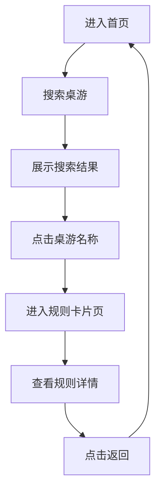

## 1. 产品概述

桌游规则小程序：收录常见桌游并生成结构化规则卡片，帮助玩家快速查阅游戏规则。用户进入首页搜索已收录桌游，点击后进入规则卡片页面查看详细规则。

## 2. 核心功能

### 2.1 用户角色
| 角色 | 注册方式 | 核心权限 |
|------|---------|---------|
| 普通用户 | 无需注册 | 搜索桌游、查看规则卡片 |

### 2.2 功能模块
1. **首页**：搜索栏、桌游列表展示
2. **规则卡片页**：桌游规则详细展示

### 2.3 页面详情
| 页面名称 | 模块名称 | 功能描述 |
|---------|---------|---------|
| 首页 | 搜索栏 | 输入关键词搜索已收录桌游 |
| 首页 | 桌游列表 | 展示搜索结果，点击可进入规则卡片 |
| 规则卡片页 | 规则内容 | 展示setup、回合操作、结束条件、计分方式、tips |
| 规则卡片页 | 返回按钮 | 返回首页 |

## 3. 核心流程

用户进入首页 → 在搜索栏输入桌游名称 → 系统展示匹配的桌游列表 → 用户点击目标桌游 → 进入规则卡片页面 → 查看详细规则 → 点击返回按钮回到首页

## 4. 用户界面设计

### 4.1 设计风格
- **主色调**：深绿色(#1a4731) + 米色(#f5f5dc) 营造桌游复古质感
- **按钮样式**：圆角矩形，悬停时有轻微阴影
- **字体**：标题使用衬线字体营造经典感，正文使用无衬线字体保证可读性
- **布局风格**：卡片式布局，信息分层清晰
- **图标风格**：使用 Lucide 图标，线条简洁

### 4.2 页面设计概述
| 页面名称 | 模块名称 | UI元素 |
|---------|---------|--------|
| 首页 | 搜索栏 | 圆角输入框，带搜索图标，占位符提示 |
| 首页 | 桌游列表 | 卡片式布局，显示桌游名称和简介 |
| 规则卡片页 | 头部 | 桌游名称 + 返回按钮 |
| 规则卡片页 | 规则内容 | 分区块展示，带图标和标签 |
| 规则卡片页 | Setup | 区分人数的设置说明 |
| 规则卡片页 | 回合操作 | 自己回合/回合外可做的事 |
| 规则卡片页 | 结束条件 | 游戏结束触发条件 |
| 规则卡片页 | 计分方式 | 过程计分 + 终局计分 |
| 规则卡片页 | Tips | 补充信息卡片 |

### 4.3 响应式设计
- 桌面端：居中布局，最大宽度800px
- 移动端：全宽布局，适配小屏幕
