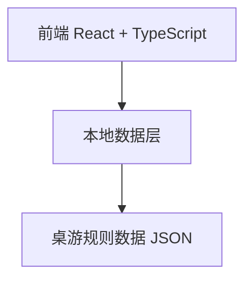

## 1. 架构设计



## 2. 技术描述

- **前端框架**: React 18 + TypeScript
- **构建工具**: Vite
- **样式方案**: Tailwind CSS
- **状态管理**: Zustand（轻量级状态管理）
- **路由**: React Router DOM
- **测试框架**: Vitest + React Testing Library
- **图标库**: Lucide React

## 3. 路由定义

| 路由 | 用途 |
|------|------|
| / | 首页 - 搜索桌游 |
| /game/:id | 规则卡片页 - 展示桌游规则 |

## 4. 数据模型

### 4.1 桌游规则数据结构

```typescript
interface GameRule {
  id: string;
  name: string;
  description: string;
  setup: {
    playerCount: string;
    steps: string[];
  }[];
  turnActions: {
    onYourTurn: string[];
    outsideYourTurn: string[];
  };
  endConditions: string[];
  scoring: {
    duringGame: string[];
    endGame: string[];
  };
  tips: string[];
}
```

### 4.2 初始数据

包含几款常见桌游的规则数据（如：卡坦岛、七大奇迹、璀璨宝石等）作为示例数据。

## 5. 组件架构

| 组件名称 | 职责 |
|---------|------|
| HomePage | 首页，包含搜索和列表 |
| SearchBar | 搜索输入组件 |
| GameList | 桌游列表展示 |
| GameCard | 单个桌游卡片 |
| RuleCardPage | 规则卡片页面 |
| RuleSection | 规则内容区块 |
| SetupSection | Setup规则展示 |
| TurnActionsSection | 回合操作展示 |
| ScoringSection | 计分方式展示 |
| TipsSection | Tips展示 |
